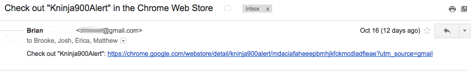
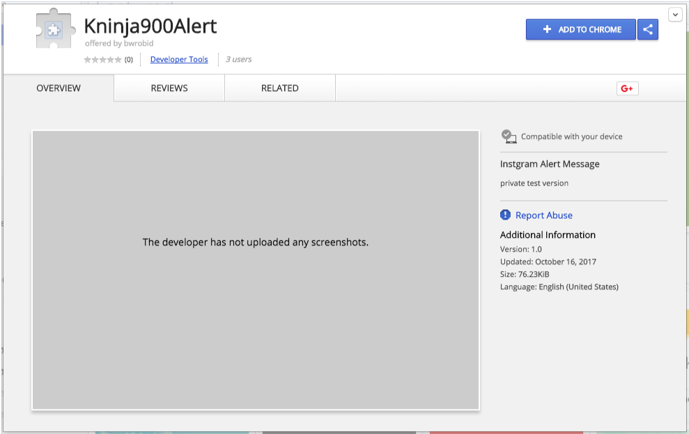
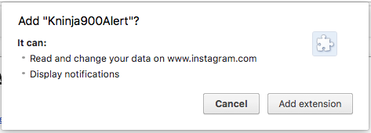
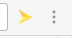
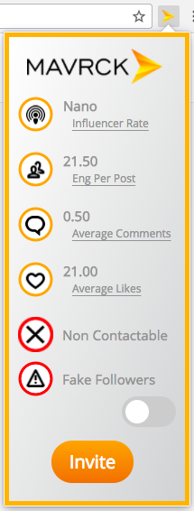

### Current Functionality
- Recognizes if you are on instagram, and when on instagram if you are on a user profile or not.  
- Can parse through text to find email address and websites.  
- Can pull JSON element found on instagram.com/*/media/  
- Can pull JSON element found on instagram.com/*/?__a=1/  

# Mavrck Marktr
SI Partner Project

**Summary:**
This Google extension will allow users while navigating Instagram, to see statistics of the profile the user is currently viewing. This will allow them to make an informed decision if the profile is a valuable as a marketing tool  

**Getting Started**
These instructions will help you install a copy of the extension and get it up and running in your Chrome browser.

**Prerequisites**
To install this extension you will first need to install Google chrome on your device.

please see the link below to install chrome if it isn't already install on your device
https://support.google.com/chrome/answer/95346?co=GENIE.Platform%3DDesktop&hl=en

**Installing**

1. You will be emailed a link to the google Mavrck Marktr extension.  As seen below. __*Note* This will not be visible if searched for in the google store__

2. Click the link in your email and you will be brought to the google chrome web store for this extension

3. Click the **+ ADD TO CHROME** button in the upper right corner of the window.

4. You will then be prompted with a popup window asking if you would like to Add Mavrck Marktr to Chrome. Click the **Add Extension** button 

5. __Congratulations you have sucessfully installed the extension!!!__

**The next few steps will teach you how to use the extension.**

1. Now that you have the extension installed and google chrome installed on you device. launch google chrome. and navigate to www.instagram.com and sign into your account

    Note if you do not have an instagram account please visit the link below to setup your account
    https://help.instagram.com/155940534568753

2. Now that you have signed in, navigate to your personal instagram. note that your address bar has your user name in it. and it says something like https://www.instagram.com/your-username/  This extension will pull the statastics from the instagram account you are currently viewing. *Note this will not function if you are looking at a feed page.

3. In the top right corner of your google chrome window to the right of the address bar, you will find the Mavrck icon. Click on the icon and this will open up the Mavrck Marktr extension. 

4. With this window open you will see statistics from the instagram account you are currently on, along with if the user has an email address made public in their account(contactable) and if the user potentially has fake folowers. 

